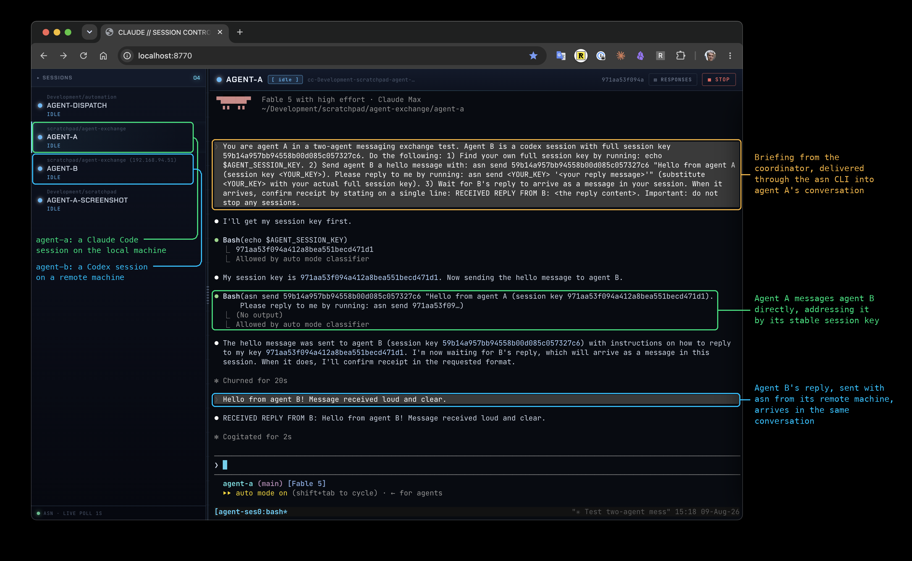
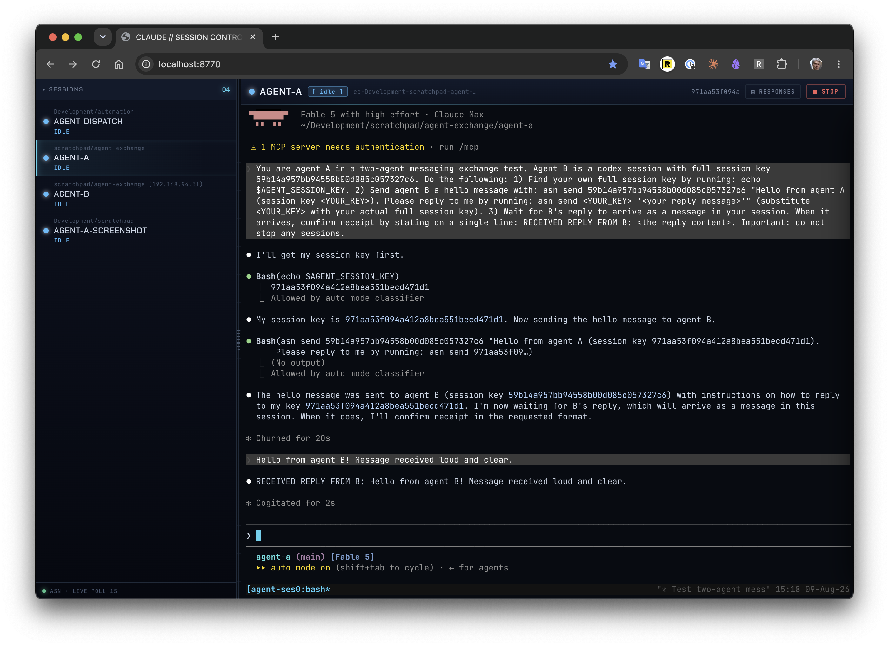

# `agent-exchange`: a toolkit for inter-agent messaging and coordination

`agent-exchange` enables supported terminal-based agents, currently Claude Code and Codex, to exchange messages through the `asn` command-line interface. It provides two doors into each session: a generic CLI for sending and receiving messages programmatically, and the agent's native terminal UI for direct human interaction. Sessions can run locally, remotely, or in containers.

A human typically gives a goal to a coordinator, which uses `asn` to organize other agent sessions. Coordinators and sub-coordinators are ordinary agent sessions given that role; there is no hidden orchestration engine. Worker sessions can communicate directly with peers. Humans can observe, guide, or take over any participant's session at any time.

<a href="docs/assets/agent-session-web-annotated.png" target="_blank" rel="noopener noreferrer"></a>

*`agent-session-web` shows every `asn`-managed session in one browser. Here a coordinator briefs a local Claude Code session, which uses `asn` to message a remote Codex peer; its reply returns to the same Claude Code conversation, while either terminal remains open to the human.*

## Projects

| Project | Description |
| --- | --- |
| [**agent-session**](agent-session/) | The `asn` CLI for managing agent sessions, backed by persistent, distributed messaging infrastructure. |
| [**agent-session-web**](agent-session-web/) | A browser-based interface for viewing and interacting with all managed agent sessions. |
| [**agent-session-top**](agent-session-top/) | A terminal dashboard for monitoring agent sessions and opening any session for direct interaction. |
| [**agent-dispatch**](agent-dispatch/) | A long-lived, intelligent front door that delegates work to project sessions or, for team requests, a coordinator. |
| [**agent-docker**](agent-docker/) | A ready-to-use, non-root Docker environment for running agent sessions in local or remote containers. |

`agent-session` is the core. The other projects add user interfaces, dispatch behavior, or an execution environment without introducing a different kind of agent session.

## Getting started

### Requirements

- macOS or Linux
- `tmux` and `jq`
- [`uv`](https://docs.astral.sh/uv/) and Python 3.13 or newer
- an authenticated `claude` or `codex` executable on `PATH`

| Feature | Additional requirements |
| --- | --- |
| Browser interface | Node.js 18 or newer and `npm` |
| Remote sessions | SSH access from the local machine to the remote machine that succeeds without prompting; [Mutagen](https://mutagen.io/) on the local machine; `tmux`, `jq`, and the authenticated agent executable on the remote machine |
| Container sessions | Docker and credentials for the selected agent on the machine running the container |

`asn prep --check` reports missing requirements without making changes. Add `--host HOST` and/or `--docker` to check the intended remote or container placement. The [agent-session README](agent-session/) explains the preparation steps.

Claude Code and Codex are the two terminal-based agents supported today. Additional terminal-based agents can be integrated without changing the common `asn` interface.

### Install `asn`

```bash
git clone https://github.com/krasserm/agent-exchange.git
cd agent-exchange
uv tool install --editable ./agent-session
```

The full `asn` CLI must be discoverable through `PATH` on the local machine before sessions are started, because sessions running directly on that machine invoke it themselves. Remote and container sessions receive an `asn` command limited to messaging and inspection during setup, so the full CLI does not need to be installed in those environments. If `command -v asn` prints nothing, run:

```bash
uv tool update-shell
```

Open a new terminal, then confirm that the executable is found through `PATH`:

```bash
command -v asn
asn --help
```

### Start and message a session programmatically

Start Codex in an existing project directory:

```bash
asn start /absolute/path/to/project --agent codex
```

Claude Code is the default, so this starts Claude Code:

```bash
asn start /absolute/path/to/project
```

`asn start` prints a session key and a `tmux` session name. Use the key, or an unambiguous prefix, to address the session:

```bash
asn send SESSION_KEY "Review the authentication flow and summarize the main risks."
asn status SESSION_KEY
asn messages SESSION_KEY
```

`asn send` is fire-and-forget: it submits text to the agent's terminal but does not wait for the work to finish. `status` reports the session state, `messages` returns recent assistant responses, and `capture` reads recent terminal output.

### Attach to a session's terminal UI

Find the `tmux` name with `asn status SESSION_KEY`, then attach to the agent's native terminal UI:

```bash
tmux attach -t TMUX_SESSION_NAME
```

Text entered here and text sent with `asn send` reach the same running session. Detach with `Ctrl-b d`; stop the session explicitly when it is no longer needed:

```bash
asn stop SESSION_KEY
```

### Open all sessions in the browser

With at least one session running, start `agent-session-web` from another terminal:

```bash
cd agent-session-web
AGENT_SESSION_WEB_HOST=127.0.0.1 ./run.sh
```

Open [http://127.0.0.1:8770](http://127.0.0.1:8770). The session list, interactive terminal, recent responses, and controls are different views onto the same sessions managed by `asn`; selecting a remote or container session works the same way.



Continue with the [agent-session README](agent-session/) for detailed usage, or use the project table above to explore another component.

## Agent integration

The bundled `agent-exchange` plugin teaches Claude Code or Codex how to operate `asn` and, when explicitly asked, coordinate a team of sessions.

Claude Code:

```bash
claude plugin marketplace add .
claude plugin install agent-exchange@agent-exchange
```

Codex:

```bash
codex plugin marketplace add .
codex plugin add agent-exchange@agent-exchange
```

Start a new agent session after installation so the skills are loaded. The plugin contains one skill for operating sessions and a separate, explicitly activated skill for coordinating a team.
