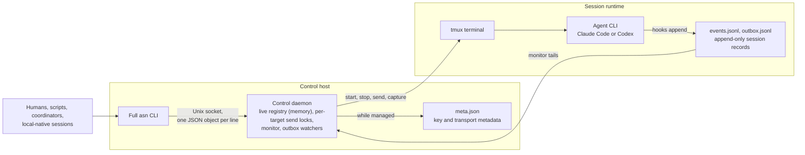
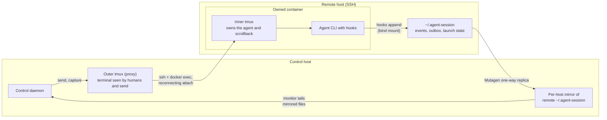
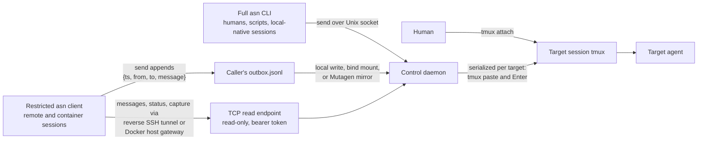
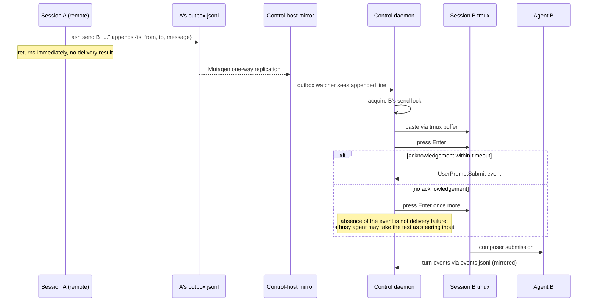

# agent-session diagrams

Visual companion to [architecture.md](architecture.md), which remains the authoritative description. Two views: management (how sessions are controlled and observed) and messaging (how text reaches and leaves a session).

## Management: control plane

One local daemon owns the live registry. The full `asn` CLI talks to it over a Unix socket; the daemon drives the session's tmux terminal and learns everything about the agent by tailing the append-only records its hooks write.

What to keep in mind:

- The management key names everything; it is not the agent's conversation ID.
- The monitor projects hook events to a small status vocabulary (`working`, `waiting`, `idle`, `backgrounded`), so `idle` means no foreground work observed, not proof of completion.
- The daemon starts with `asn start` or `asn daemon start`, exits when the last session stops, and never restores its registry from disk.

## Management: placement composition

The diagram above is literal for a local-native session. Other placements insert transport layers between the daemon and the runtime. Remote container is the fullest case:

The other placements are subsets of this picture:

- **Remote native** drops the container: the inner tmux and state directory live directly on the SSH host.
- **Local container** drops the SSH and mirror legs: the proxy attaches with `docker exec` alone, and the bind-mounted state is written directly on the control host.
- **Local native** drops everything: the agent runs in local tmux and writes local files.

The inner tmux survives link loss and is authoritative for capture. A vanished outer proxy means `disconnected`, not agent termination.

## Messaging: paths into and out of a session

All input converges on the same terminal composer. Reads by remote and container sessions go through a separate, read-only channel.

What to keep in mind:

- Outbox send is fire-and-forget: the sender gets no delivery result, and daemon-side delivery is at most once with no replay of records written before the watcher attached.
- The read endpoint cannot start, stop, or send. A valid token proves a live managed session but is not scoped to it as a read target.
- Direct human input bypasses daemon serialization; tmux and the agent composer are the only arbitration.

## Messaging: peer send, end to end

A remote session messaging another session, from append to composer submission:

A successful send means the terminal submission attempt completed. Whether a turn started, finished, or produced a reply must be verified through `status`, `messages`, or resulting artifacts.
